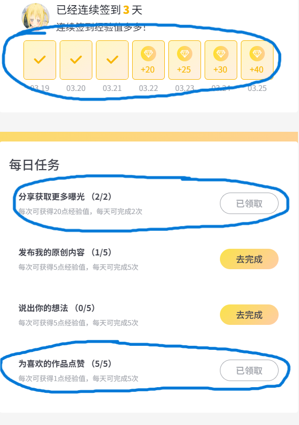

# my.nikon.com.cn 网站自动签到脚本

## 项目概述
使用Selenium和本地Edge驱动实现浏览器自动化，可以完成 **1连续签到** **2为喜欢的作品点赞** **3分享获取更多曝光（网站原因关闭了此功能）** **4说出你的想法** 。

  

## 注意事项
0. **预先设置**：https://my.nikon.com.cn/user/setting -->接受弹窗信息-->全部关闭
1. **包含直接启动包**: 右方Releases可下载一键启动包，JRE与驱动配置齐全点击即可运行
2. **浏览器驱动**: 地Edge驱动 (edgedriver_win64/msedgedriver.exe)可能更新不及时导致无法启动，可去[微软浏览器驱动官网](https://developer.microsoft.com/zh-cn/microsoft-edge/tools/webdriver/)下载
3. **登录及安全性**: 项目需要用户自己配置手机号与密码，仓库源码无法收集用户数据，请放心。

## 源码运行环境
- **OS**: Windows11
- **JDK**: Java 25+
- **Maven**: 3.6+
- **浏览器驱动**: 本地Edge驱动 (edgedriver_win64/msedgedriver.exe)

## 日志
-  4/6 : 更新发行包浏览器驱动版本
-  3/25：适配新版本我的尼康的代码和包发布，由于bug（我指的是网站）多，分享功能暂时关闭，增加了评论功能。
-  3/23下午：貌似新版本bug不少，回滚老版本了，流汗黄豆。
-  3/23上午：太帅了尼康，我刚用三天，整个网站页面全部重构了。

