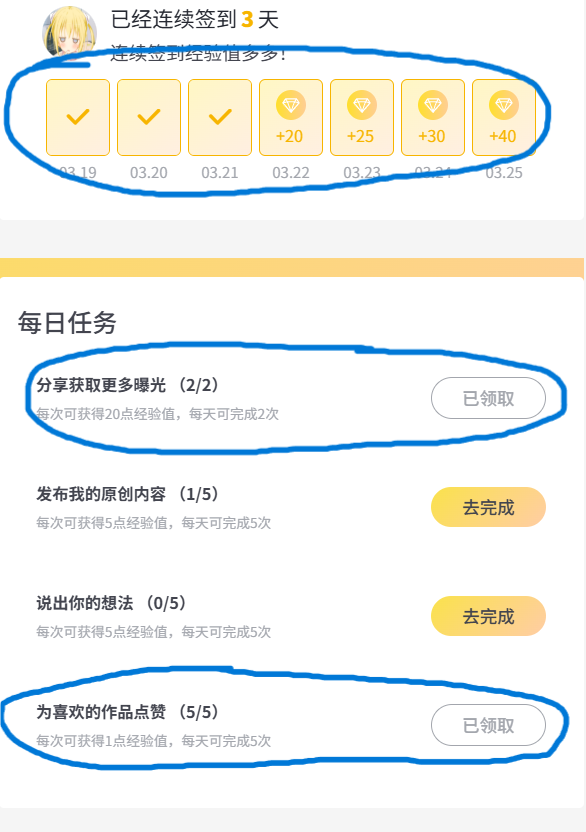

# my.nikon.com.cn 网站自动签到脚本 — .NET 10

## 项目概述

使用 **Microsoft Playwright** 和本地 Chromium 系浏览器（Chrome / Edge）实现浏览器自动化，可以完成以下任务：

-  **每日签到** — 自动完成连续签到
-  **为作品点赞** — 为喜欢的作品点赞获取积分
-  **分享获取曝光** — 因网站原因此功能无法使用，未开启
-  **发表评论** — 说出你的想法



> **技术栈**: .NET 10 · Microsoft Playwright · 依赖注入 · 结构化日志


## 快速开始

### 1. 配置账号

复制 `账号密码配置.example.txt` 为 `账号密码配置.txt`，填写以下内容：

```ini
手机号=138xxxxxxxx
密码=your_password
无头模式=T
等待时间(毫秒)=0
```

> `无头模式` 设为 `F` 可看到浏览器操作过程，方便调试。

> 首次运行会自动下载 Playwright 浏览器依赖（`playwright install chromium`）。

## 常见问题
> 卡在`已点击确认按钮`通常为密码错误
> 卡在或报错`登录完成，执行 CheckIn 流程...`几步通常为网络问题，请适当增加基础等待时间。单位ms
> 无头模式左上方有窗口为正常现象

## 运行环境

| 依赖 | 版本要求 |
|------|---------|
| **OS** | Windows 11（推荐） |
| **浏览器** | Google Chrome 或 Microsoft Edge（自动检测） |

> 项目会自动检测本地的 Chrome / Edge 浏览器，无需手动配置驱动路径。

## 注意事项

1. **预先设置**：访问 https://my.nikon.com.cn/user/setting → 接受弹窗信息 → 全部关闭
2. **浏览器兼容**：首次运行时 Playwright 会自动下载内置 Chromium 作为兜底，但使用本地 Chrome/Edge 体验最佳
3. **登录及安全性**：项目需要您自行配置手机号与密码，源码不会收集任何用户数据，请放心使用
4. **左上角**：运行时无头模式左上角仍会有一个小窗口，属于 Playwright 特性

## 发布独立包

```bash
dotnet publish -c Release
```

生成的单文件可执行程序位于 `bin/Release/net10.0/win-x64/publish/`。

## 更新日志

- **2026-07-07**: 重写为.NET 10，支持exe运行
- **2026-05-10**: 更新 Edge 浏览器驱动版本
- **2026-04-08**: 官网任务适配更新，增加了点赞次数
- **2026-04-06**: 更新发行包浏览器驱动版本
- **2026-03-25**: 适配新版本我的尼康，分享功能暂时关闭，增加了评论功能
- **2026-03-23**: 网站页面全面重构适配


